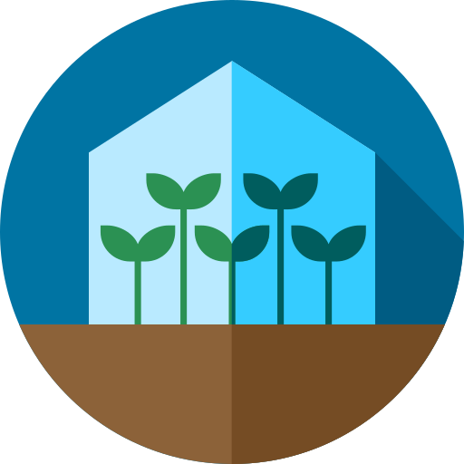

    
    <h1>plant-manager</h1>
    

    <a href="https://github.com/heofs/plant-manager">React application for greenhouse management.</a>
    

## Using

- ReactJS
- GraphQL
- Apollo
- Firebase
- Reactstrap
- styled-components
- react-testing-library
- Custom React Hooks

## Setup

Change the Firebase config in [Src -> Utils -> firebase.js](./src/utils/firebase.js), to the config from your personal Firebase project.

## Available Scripts

In the project directory, you can run:

### `npm start`

Runs the app in the development mode.  
Open [http://localhost:3000](http://localhost:3000) to view it in the browser.

### `npm test`

Launches the test runner in the interactive watch mode.  
See the section about [running tests](https://facebook.github.io/create-react-app/docs/running-tests) for more information.

### `npm run build`

Builds the app for production to the `build` folder.

## Resources

<https://create-react-app.dev/docs/advanced-configuration>

## Licence

[GNU General Public License v3.0](https://github.com/TheFox/GPLv3.md/blob/master/gplv3.md)
